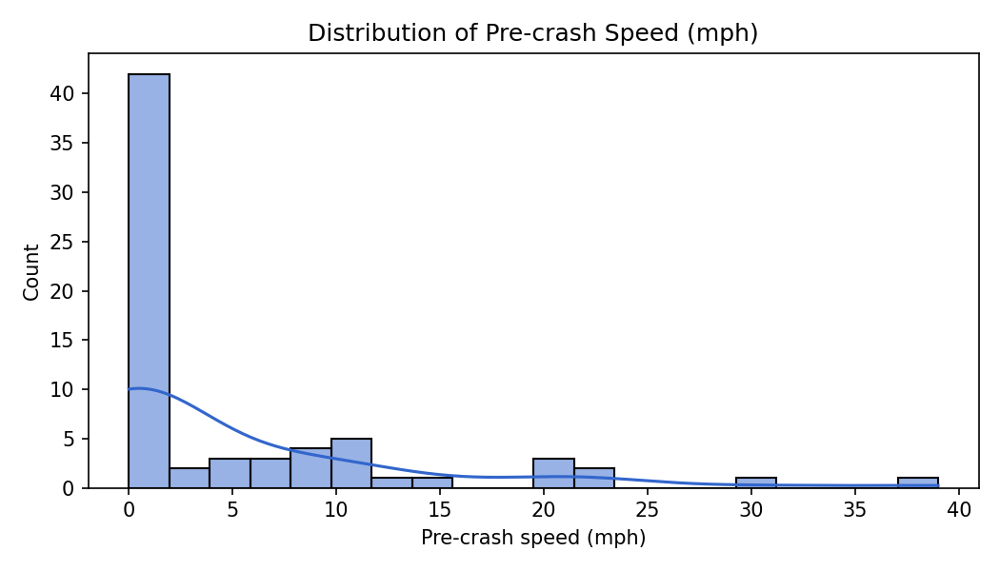

# Homework #3: Collaborative Data Wrangling & EDA

Minimal scaffolding for the assignment. Fill in dataset choice, cleaning steps, and EDA later.

## Dataset
- **Source:**
  
  National Highway Transporation Safety Asssociation's Standing General Order on Crash Reporting for Advanced Driving Systems (ADS) as of August 2025,
  Obtained September 2025,
  https://www.nhtsa.gov/laws-regulations/standing-general-order-crash-reporting#data

- **Description:**
  
  Self-reported crashes from car companies were physical damage occured involving a level 3 through 5 autonomous vehicle.

  The subset of data used consisted of the following:

| Variable               | Description                                                                 |
|-------------------------|-----------------------------------------------------------------------------|
| `year`                 | The calendar year when the record/event was reported.                      |
| `month`                | The month of the record/event (1–12).                                       |
| `hour`                 | The hour of the day (0–23) when the event occurred.                        |
| `reporting_entity`     | The organization or agency that submitted the report.                      |
| `make`                 | The manufacturer of the vehicle (e.g., Toyota, Ford, Honda).                |
| `model`                | The specific vehicle model (e.g., Camry, F-150, Civic).                     |
| `model_year`           | The model year of the vehicle, usually defined by the manufacturer.         |
| `roadway_type`         | The classification of the road (e.g., highway, street, intersection).   |
| `sv_pre_crash_movement`| The vehicle’s movement just before the crash (e.g., going straight, turning right).|
| `sv_precrash_speed_mph`| The speed of the subject vehicle (in miles per hour) before the crash.      |

## Data Cleaning Steps:
  
1. Cleaned the column names
2. Filtered the reports to version 1
3. Selected a subset of the data consisting mostly of the columns given in the table above
4. Derived the `year`, `month`, and `hour` columns from the `incident_date` and `incident_time_24_00` columns
5. Dropped the `incident_date` and `incident_time_24_00` columns
   
## How To Use
- Place raw data in `data/raw/`.
- Put cleaned/derived data in `data/cleaned/`.
- Add analysis code in `notebooks/eda.ipynb` or new notebooks.

## Collaboration
- Each partner: create a branch, make commits, open a PR.
- Intentionally create/resolve one small conflict (e.g., edit this intro).

## Exploratory Data Analysis (Partner B)

- Summary statistics computed on the cleaned dataset (see `notebooks/eda_summary.md`):
  - Row/column counts
  - Pre-crash speed (`sv_precrash_speed_mph`) mean, median, std, min, max
  - Top 10 vehicle makes; counts by year
  - Correlation: `sv_precrash_speed_mph` vs `model_year`

- Visualizations (generated by code, saved under `notebooks/figures/`):
  - `speed_hist.png` — Histogram of pre-crash speeds
  - `top_makes.png` — Bar chart of top 10 makes

## Results

- Key findings (see `notebooks/eda_summary.md` for exact numbers):
  - The cleaned sample contains 68 rows (2025 only in this subset).
  - Pre-crash speeds are low on average with a heavy mass at 0 mph.
  - One manufacturer dominates the report counts in this slice.

Representative figure:

## Reproducibility Instructions

### Data Cleaning (Partner A, R)
- See `notebooks/clean_data_script.R` for the steps used to produce `data/cleaned/SGO-ADS-crash-data-clean.csv`.

### EDA (Partner B, Python)
1) Create and activate a virtual environment (optional):
   - `python3 -m venv .venv && source .venv/bin/activate`
2) Install dependencies:
   - `pip install -r requirements.txt`
3) Run the EDA script to regenerate summary and figures:
   - `python notebooks/eda.py`
4) Outputs:
   - Summary: `notebooks/eda_summary.md`
   - Figures: `notebooks/figures/speed_hist.png`, `notebooks/figures/top_makes.png`

Dependencies are listed in `requirements.txt` (pandas, seaborn, matplotlib).

## Collaboration Notes

- Partner A (@c-a-s-t-l-e): data sourcing, cleaning script (R), cleaned CSV, initial README sections.
- Partner B (@Bryan-Nsoh): EDA script (Python), figures, README documentation updates.
- Both: repository organization, PRs, and conflict resolution.
